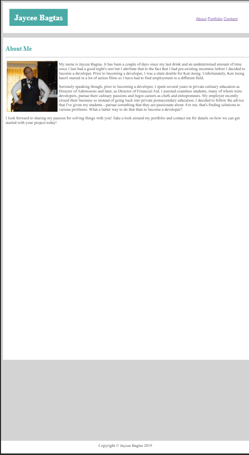

# Portfolio
Portfolio of past, current, and future work

Welcome to my portfolio. On this site, I showcase my development as a developer. This site also serves as a tool to help me measure my growth by allowing me to compare my past work with my current projects. 

If you have any questions, feel free to email me.

Jaycee Bagtas
jaycee.bagtas@gail.com

## Post Full Stack Boot Camp Update
This site was the second website that I did as part of my Full Stack Boot Camp over at UCSD Extension through Trilogy Education Services. It was one of the first coding assignments that we were tasked with and as cringy as it looks now, I'm still pretty proud of it. Here is an image of the site as deployed on GitHub Pages:

